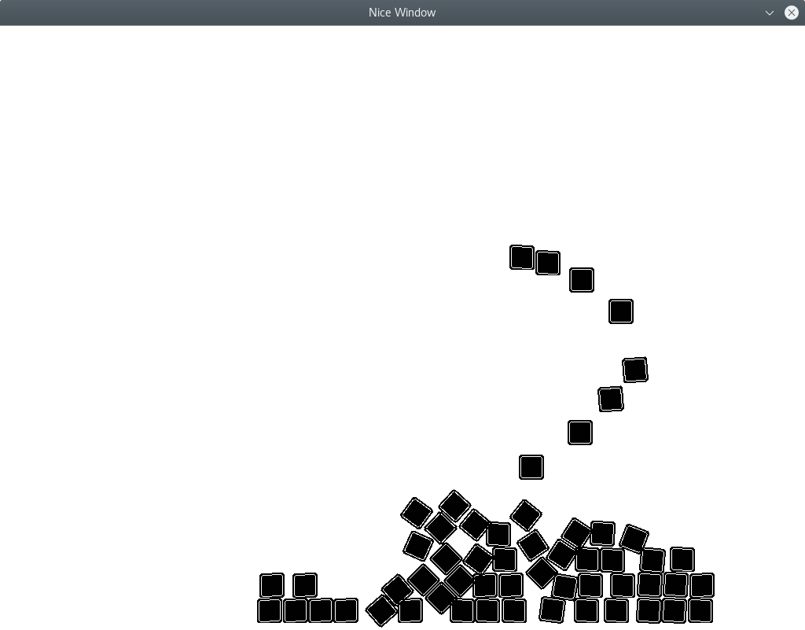

# pyengine
Basic 2D physics based game engine in Python3 with pygame and pybox2d.

Supports mouse/keyboard input, creation of 2D physics objects, creating a window.

### Dependencies
- pygame
- pybox2d

### Usage
Test demo can be found `src/main.py`. Run with `python3 main.py`.

